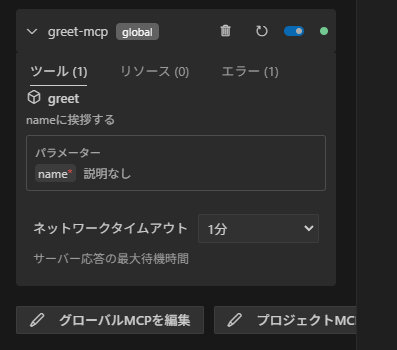
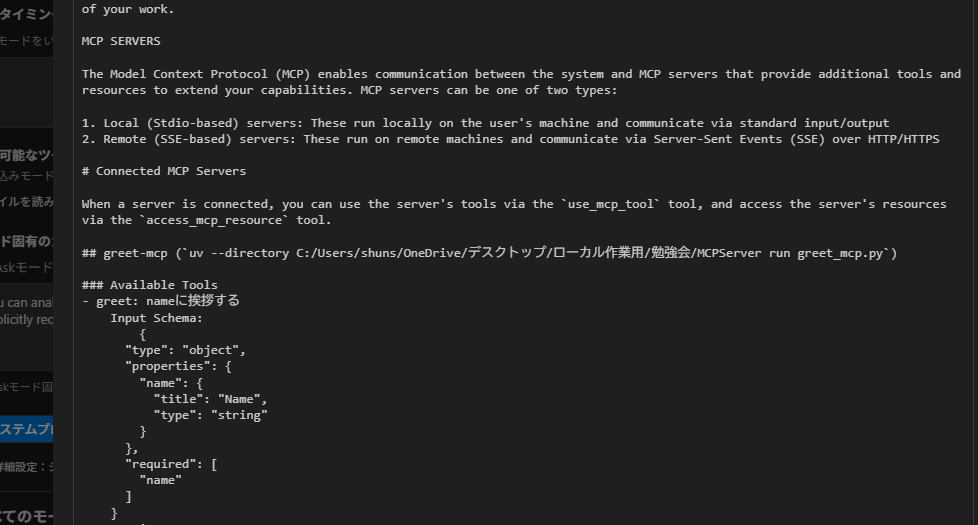
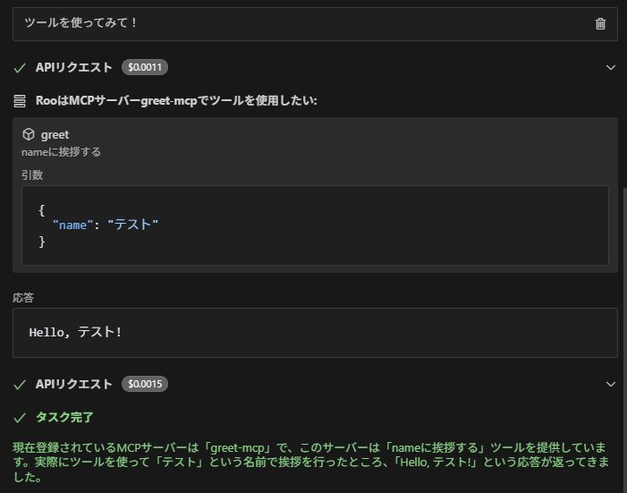
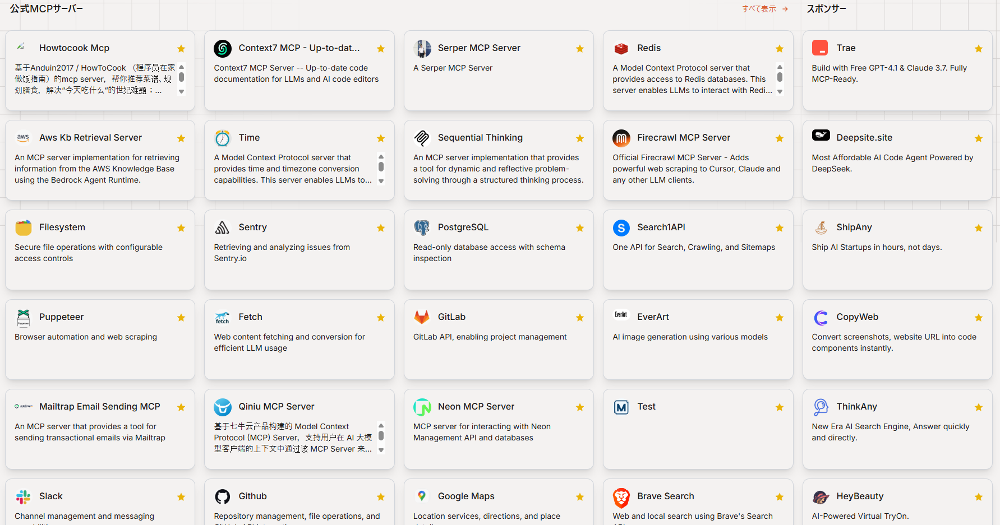

# なぜ今、MCPなのか？
### 〜AIに"指示できる時代"を支えるプロトコル〜

---

## 🌍 今までは「答えるAI」だった

- ChatGPTなどの生成AIは、質問に答えたり文章を要約したりしてくれる。
- でも、それだけでは実際の作業や操作まではできない。
- 例：「Gitで新しいリポジトリを作って」と言っても、AIは直接操作できない。　　　　　　

> 💬 「AIにできること、意外と少ない？」と思ったことはありませんか？

---

## 🤖 次のステージ：「AIに行動させる」

- 最近のAIは、"答える"から"行動する"へ進化している。
- 「検索して」「資料をまとめて」「ファイルを探して」…
- そんな実務的な指示をAIが実行できる時代が始まりつつあります。

> 🌟 行動するためには「何をどう行動するのか」といった決まりが必要です。

---

## 🧩 その鍵が「MCP」──Model Context Protocol

- MCPとは、AI（LLM）とツールのあいだの **共通の"呼び出し言語"** です。
- Anthropicが2024年11月にオープンソースとして発表した。
- AIがツールを使うための「USBポート」のようなもの。
  - ツールの種類はたくさんあっても、接続方法は統一されている。
  - ツールに修正があっても、接続口や本体を修正しなくて良い。

- Microsoftも2025年にWindowsへのMCP統合を発表し、大注目！

---

## 🔍 MCPの構成
- MCPホスト：LLM、チャット画面、MCPクライアントを内蔵したアプリ
  - Claude Desktop, Cline, roo code
- MCPクライアント：MCPサーバーとやり取りを行う
  - 基本的にMCPホストに内蔵されている
- MCPサーバー：複数ツールを持っていて実際に処理を行う
  - Githubで公開されているものを使ったり自作したりする
  - リモートだったりローカルだったりする

---

## 🔍 MCPの仕組み（ざっくり）

1. MCPサーバーが「自分はこういう機能がありますよ」という **自己紹介カード（＝メタデータ）** をLLMに渡す
2. LLMがユーザーから質問を受けると、そのカードを見て自然言語から適切なツールを選ぶ
3. 選ばれたツールをMCPサーバーが実行して結果をLLMに返す

> 📦 MCPは、上記の呼び出し方・受け渡し方を共通化したプロトコルです

---

## 🧠 APIではダメなのか？

| 項目 | 従来のAPI連携 | MCP |
|------|------------------|----------------------------|
| 接続方法 | APIごとに異なる | 基本部分は統一 |
| 保守性 | 仕様変更のたびにコードを修正 | 仕様が変わってもLLMはそのまま使える |
| 拡張性 | ツール追加に複雑な実装が必要 | 登録すればLLMがすぐ使える |

> ⚙️ MCPは仕様書ごとLLMに渡すことで、ツールの変更を動的に反映できる

---

## 📚 活用イメージ（身近な業務にどう使える？）

- 📁 ファイル操作：回答をそのままファイルに反映して保存する
- 💻 Git操作：新規リポジトリ作成、コミット履歴の確認などを自然言語で
- ✉ メール操作：メールを検索したり要約したり送信したりする
- 📚 論文検索：arXivなどの最新研究をAIに代わりに探してもらう
- 📊 社内DBの検索：「〇〇部のPLは？」→SQLなしで結果が出る
- ✏ チャットの投稿：投稿内容をレビューしてもらってそのまま投稿する

---

## 🔧 MCPサーバーの動かし方
### 1/4. MCPサーバーを作成する
fastmcpを使うことで、 **関数をそのままツール化** 可能

```python
from fastmcp import FastMCP
mcp = FastMCP(name="greet-mcp")

@mcp.tool() # 1つのpyファイルに複数のツールを作成可能
def greet(name: str)-> str:
  """nameに挨拶する"""
  return f"Hello, {name}!"

mcp.run(transport="stdio")
```

このファイルを実行するだけでMCPサーバーが立ち上がり、LLMから呼び出せます✨

---
## 🔧 MCPサーバーの動かし方
### 2/4. MCPホストのMCP設定ファイルを編集する
MCPホストには必ず「mcp.json」のようなMCP設定ファイルがある
```json
{
  "mcpServers": {
    "greet-mcp": {
      "command": "uv",
      "args": [
        "--directory",
        "C:/Users/shun/OneDrive/デスクトップ/ローカル作業用/勉強会/MCPServer",
        "run",
        "greet_mcp.py"
      ]
    }
  }
}
```


---
## 🔧 MCPサーバーの動かし方
### 3/4. MCPホストがMCPサーバーを立ち上げる
MCPホストがMCPサーバーを立ち上げてメタデータを読み込んだ状態


---

MCPホストのLLMのシステムプロンプトにメタデータが組み込まれている様子
メタデータを自動で反映するため、MCPホストはツールの変更を即座に反映できる


---
## 🔧 MCPサーバーの動かし方
### 4/4. MCPホストでMCPサーバーを実行する


---

自分で作らなくても公式のMCPサーバーを使うことができる。



---

## 📎 社内活用の課題

- 使えるMCPホストが限られている
  - vscodeの拡張機能であるClineかroo codeぐらい
- オープンソースのMCPサーバーを立ち上げられない
  - 公式MCPサーバーの立ち上げはnode.jsやdockerが基本
- オープンソースのMCPサーバーのツールを使えない
  - ツールがAPIを呼び出したりインターネットに接続する場合が多く、社内の制限に引っかかる 

---

## 📎 社内活用の課題への対応

- 使えるMCPホストが限られている
  - vscodeの拡張機能であるClineやroo codeぐらい
  →**MCPホストサーバーを立ち上げてブラウザから使えるようにする**
- オープンソースのMCPサーバーを立ち上げられない
  - 公式MCPサーバーの立ち上げはnode.jsやdockerが基本
  →**pythonへの書き換え**
  →**MAWSで立ち上げてリモートMCPサーバーとする**
- オープンソースのMCPサーバーのツールを使えない
  - ツールがAPIを呼び出したりインターネットに接続するものが多く、社内の制限に引っかかる 
  →**APIのホワイトリスト登録**
  →**WEBサイトへの通信はプロキシを通す**

---

## 🎁 まとめ

- MCPとはLLMとツールを接続するための通信規約のこと
- MCPのメリットは
  - LLMとツールを独立させられること
  - 非エンジニアでも自然言語でツールが使えるようになること

- 今後のAI活用において、USB並みに普及する可能性のある通信規約です✨

---

## 🎥 デモなど

- git操作
- DB操作

---

## 補足など
- MCPサーバーが提供するのはツール以外に、リソース、プロンプトの計3種類
- MCPサーバーはメタデータを渡す前に認証を行う。基本的には認証トークン。
- MCPサーバーの通信はSTDIO、SSE、HTTP